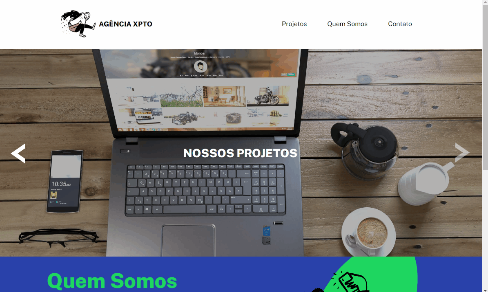

# MapaDevWeek - Mini portfólio.

Essa é a minha versão do projeto Agência XPTO.

## Conteúdos

- [Visão geral](#visão-geral)
  - [Screenshot](#screenshot)
  - [Links](#links) 
- [Meu processo](#meu-processo)
  - [Feito com](#feito-com)
  - [Autor](#author)
## Visão Geral

Nesse projeto fazemos uma página com elementos como:
- Página com seções
- Seção de projetos com elementos interativos
  - Botões que trocam a imagem de fundo
- Seção de sobre
- Seção de contatos
- Botões de redes sociais
- Estados de hover para elementos

### Screenshot

### Links

- Link da minha solução: [Repositório GitHub](https://github.com/Leandro-Sousa-dev/agencia-xpto)
- Link do site hospedado: [Site hospedado Github pages](https://leandro-sousa-dev.github.io/agencia-xpto/)

## Meu processo

Meu processo foi pensar primeiro nos containers de cada elemento, fazer a estrutura html baseado nisso, só então pensar nos estilos, posicionamento, etc.

### Feito com

- Tags HTML5 semâticas 
- Propriedades CSS costumizadas 
- CSS
- Flexbox
- JavaScript

## Autor

- GitHub - [Leandro-Sousa-dev](https://github.com/Leandro-Sousa-dev)
- Frontend Mentor - [@Leandro-Sousa-dev](https://www.frontendmentor.io/profile/Leandro-Sousa-dev)
- linkedIn - [José Leandro](https://www.linkedin.com/in/jos%C3%A9-leandro-7ba007261/)
